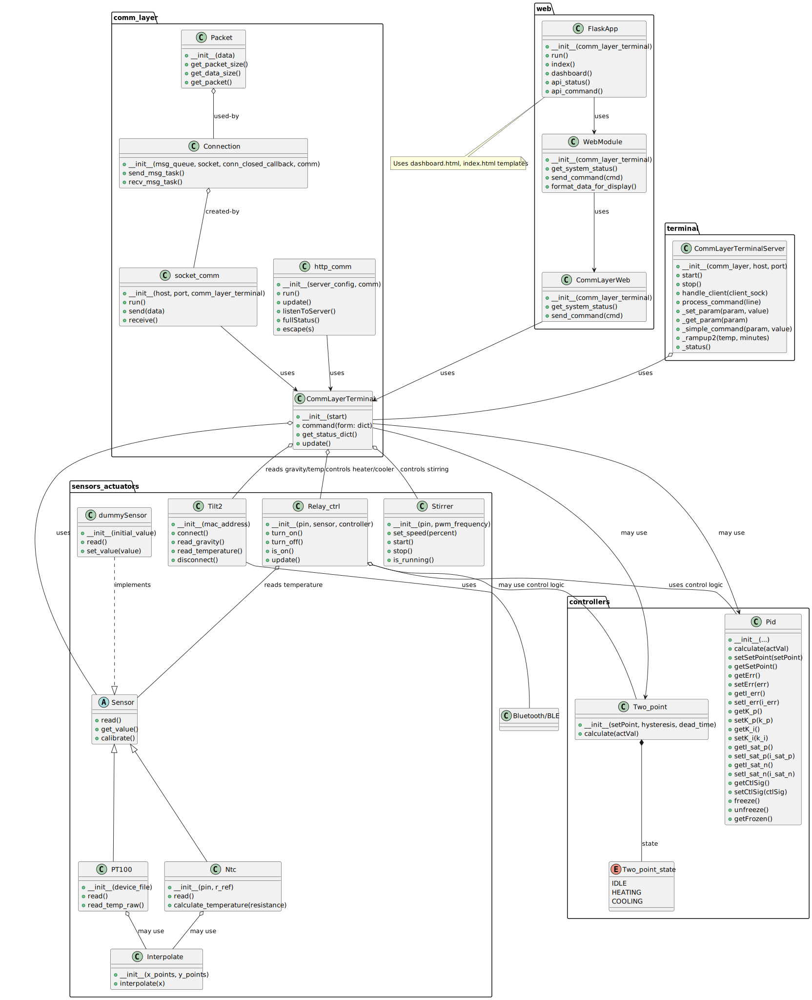

# Brewing Control System 

## Table of Contents

- [Overview](#overview)
- [Architecture](#architecture)
- [Module Descriptions](#module-descriptions)
  - [Core Control & Communication](#core-control--communication)
  - [Sensors & Actuators](#sensors--actuators)
  - [Utilities & Support](#utilities--support)
  - [Testing & Debugging](#testing--debugging)
- [Extending the System](#extending-the-system)
- [Example Usage](#example-usage)
- [File Structure](#file-structure)
- [License](#license)
- [Contact](#contact)

---

## Overview

This project is a modular, extensible brewing control system that runs on a raspberry pi. It supports real-time monitoring and control of brewing hardware, secure communication with remote servers, and integration with various sensors and actuators. The system is designed for robustness, thread safety, and easy extensibility.

---

## Architecture

The system is organized into the following layers:

- **Core Control & Communication:** Handles the main control logic, server communication, and socket interfaces.
- **Sensors & Actuators:** Provides drivers and interfaces for temperature sensors, relays, stirrers, and other hardware.
- **Utilities & Support:** Includes PID control, system information, timers, and scanning utilities.
- **Testing & Debugging:** Contains modules for debugging, testing, and data logging.



<!-- Rest of your overview content -->
---

## Module Descriptions

### Core Control & Communication

#### `comm_layer.py`
- **Class: Comm_layer**
  - Central interface to hardware and control logic.
  - **Attributes:** `start` (hardware/control logic reference)
  - **Methods:**
    - `__init__(start)`
    - `command(form: dict)`
    - `get_status_dict()`
    - `update()`

#### `http_comm.py`
- **Class: http_comm**
  - Handles HTTPS communication with the remote server.
  - **Attributes:** `server_config`, `comm`, `ssl_context`, `lock`
  - **Methods:**
    - `__init__(server_config, comm)`
    - `run()`
    - `update()`
    - `listenToServer()`
    - `fullStatus()`
    - `escape(s)`

#### `socket_comm.py`
- **Class: socket_comm**
  - Manages local socket-based communication for real-time control or monitoring.
  - **Attributes:** `host`, `port`, `comm_layer`
  - **Methods:**
    - `__init__(host, port, comm_layer)`
    - `run()`
    - `send(data)`
    - `receive()`

#### `start.py`
- **Functionality:** Entry point for initializing and starting the brewing control system.
  - Initializes hardware, communication layers, and starts main loops.

---

### Sensors & Actuators

#### `pt100.py`, `pt100_2.py`
- **Class: PT100 / PT100_2**
  - Driver for PT100 temperature sensors.
  - **Attributes:** `channel`, `calibration`
  - **Methods:**
    - `__init__(channel, calibration)`
    - `read_temperature()`

#### `ntc.py`
- **Class: NTC**
  - Driver for NTC thermistors.
  - **Attributes:** `pin`, `beta`, `r0`
  - **Methods:**
    - `__init__(pin, beta, r0)`
    - `read_temperature()`

#### `sensor.py`
- **Class: Sensor**
  - Abstract base class/interface for all sensors.
  - **Methods:**
    - `read()`

#### `dummySensor.py`
- **Class: DummySensor**
  - Simulated sensor for testing.
  - **Methods:**
    - `read()`

#### `relay_ctrl.py`
- **Class: RelayCtrl**
  - Controls relay switches for actuators (heaters, pumps, etc.).
  - **Attributes:** `relay_pins`
  - **Methods:**
    - `__init__(relay_pins)`
    - `set_state(relay, state)`
    - `get_state(relay)`

#### `stirrer.py`
- **Class: Stirrer**
  - Controls a motorized stirrer.
  - **Attributes:** `pin`, `speed`
  - **Methods:**
    - `__init__(pin)`
    - `set_speed(speed)`
    - `start()`
    - `stop()`

---

### Utilities & Support

#### `pid.py`
- **Class: PID**
  - Implements a PID controller for temperature or process control.
  - **Attributes:** `kp`, `ki`, `kd`, `setpoint`, `output_limits`
  - **Methods:**
    - `__init__(kp, ki, kd, setpoint, output_limits)`
    - `compute(measurement)`
    - `reset()`

#### `two_point_control.py`
- **Class: TwoPointControl**
  - Implements a simple on/off (bang-bang) controller.
  - **Attributes:** `setpoint`, `hysteresis`
  - **Methods:**
    - `__init__(setpoint, hysteresis)`
    - `compute(measurement)`

#### `timer.py`
- **Class: Timer**
  - Provides timing utilities for scheduling and delays.
  - **Methods:**
    - `start()`
    - `stop()`
    - `elapsed()`

#### `sysinfo.py`
- **Functionality:** Gathers system information (CPU, memory, uptime) for diagnostics and status reporting.

#### `ScanUtility.py`
- **Class: ScanUtility**
  - Provides device or network scanning utilities.
  - **Methods:**
    - `scan_devices()`
    - `scan_network()`

---

### Tilt Hydrometer Integration

#### `tilt2_client.py`
- **Class: Tilt2Client**
  - Communicates with Tilt hydrometers via BLE.
  - **Methods:**
    - `scan()`
    - `get_reading()`

#### `tilt2_server.py`
- **Class: Tilt2Server**
  - Provides a server interface for Tilt hydrometer data.
  - **Methods:**
    - `start_server()`
    - `handle_request()`

#### `tilt2_bleak.py`
- **Functionality:** BLE communication utilities for Tilt hydrometers.

#### `tilt2_test.py`
- **Functionality:** Test suite or script for Tilt hydrometer integration.

---

### Data Logging

#### `dataLogger.py`
- **Class: DataLogger**
  - Logs sensor and process data to file or database.
  - **Attributes:** `filename`, `buffer`
  - **Methods:**
    - `__init__(filename)`
    - `log(data)`
    - `flush()`

#### `testDataLogger.py`
- **Functionality:** Test suite or script for data logging functionality.

---

### Testing & Debugging

#### `dbg.py`
- **Functionality:** Debugging utilities, logging, or interactive debugging tools.

---

## Extending the System

- **Add new sensors:** Implement a new class in `sensor.py` and register it in `comm_layer.py`.
- **Add new actuators:** Extend `relay_ctrl.py` or create a new actuator module.
- **Add new control logic:** Implement new controllers in `pid.py` or `two_point_control.py`.
- **Integrate new communication protocols:** Add modules similar to `http_comm.py` or `socket_comm.py`.

---

## Example Usage

```python
from comm_layer import Comm_layer
from http_comm import http_comm
from start import initialize_system

# Initialize hardware and control logic
start = initialize_system()
comm_layer = Comm_layer(start)

# Server configuration
server_config = {
    "server_address": "your.server.address"
}

# Initialize HTTP communication
http = http_comm(server_config, comm_layer)
http.run()
```

---

## File Structure

```
.
├── comm_layer.py
├── dbg.py
├── http_comm.py
├── pid.py
├── pt100.py
├── ScanUtility.py
├── socket_comm.py
├── stirrer.py
├── testDataLogger.py
├── tilt2_client.py
├── tilt2_test.py
├── two_point_control.py
├── dataLogger.py
├── dummySensor.py
├── ntc.py
├── pt100_2.py
├── relay_ctrl.py
├── sensor.py
├── start.py
├── sysinfo.py
├── tilt2_bleak.py
├── tilt2_server.py
├── timer.py
└── doc.md
```

---

## License

[Specify your license here]

---

## Contact

For questions or contributions, please contact [your-email@example.com].

---

**Note:**  
Descriptions are based on standard conventions and inferred from file/module names. For precise details, refer to the actual code or update this documentation as needed.